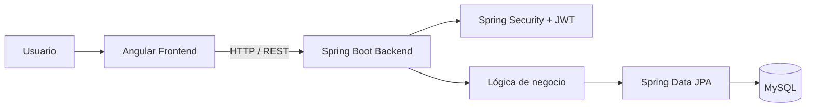
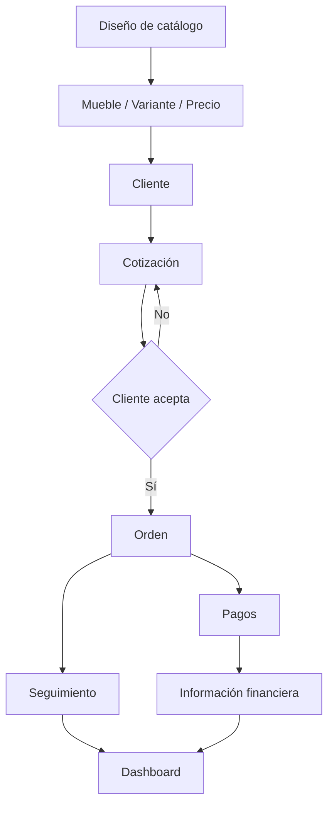
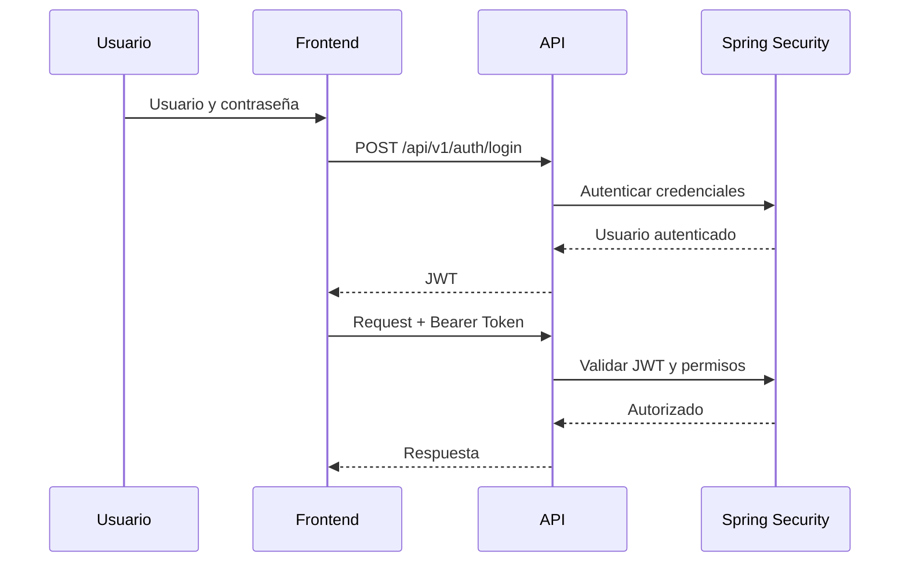
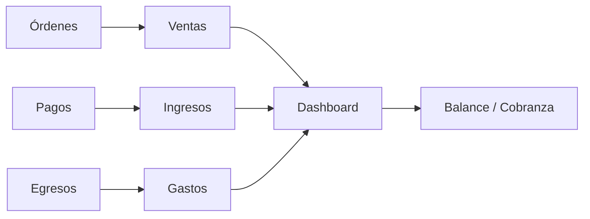
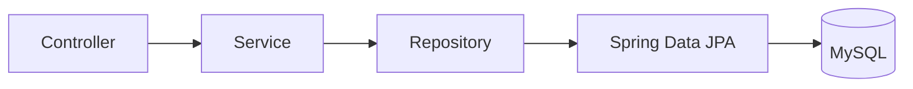

# ERP Mueblerías Kuko — Backend

API REST desarrollada con **Java y Spring Boot** que funciona como backend de **ERP Mueblerías Kuko**, un sistema creado para digitalizar y centralizar procesos comerciales, financieros y operativos de una mueblería artesanal.

**Versión actual:** V1  
**Estado:** Funcional / En evolución  
**Frontend:** Repositorio independiente

---

## Descripción

Este repositorio contiene exclusivamente el **backend de ERP Mueblerías Kuko**.

La aplicación concentra la lógica de negocio, persistencia, autenticación, autorización, procesamiento financiero, gestión de imágenes y generación de documentos utilizados por el frontend Angular.

La V1 permite administrar información relacionada con:

- **Usuarios y roles**
- **Clientes**
- **Catálogo de diseños**
- **Muebles y variantes de precio**
- **Cotizaciones**
- **Órdenes**
- **Pagos asociados a órdenes**
- **Egresos**
- **Dashboard financiero y operativo**
- **Generación de documentos PDF**
- **Gestión de imágenes del catálogo**

El sistema nació de una necesidad real de la mueblería: sustituir procesos que originalmente se administraban mediante libretas y registros manuales y que posteriormente evolucionaron a una solución desarrollada en **Excel con macros**.

---

# Objetivo del backend

El objetivo principal es proporcionar una **API REST centralizada y protegida** que permita administrar los datos y reglas de negocio del ERP.

El backend es responsable de:

- Persistencia de información.
- Reglas de negocio.
- Autenticación.
- Autorización por roles.
- Validación de operaciones.
- Relaciones entre entidades.
- Procesamiento de pagos y egresos.
- Cálculo de indicadores.
- Generación de PDF.
- Gestión de imágenes.
- Comunicación con la base de datos.

---

# Arquitectura general

ERP Mueblerías Kuko utiliza una arquitectura **cliente-servidor**.



El backend expone los recursos necesarios mediante endpoints REST bajo una ruta similar a:

```text
/api/v1/**
```

---

# Stack tecnológico

| Tecnología | Versión / función |
|---|---|
| **Java** | 21 |
| **Spring Boot** | 3.3.4 |
| **Spring Web** | API REST |
| **Spring Security** | Autenticación y autorización |
| **JWT / JJWT** | 0.11.5 |
| **Spring Data JPA** | Persistencia |
| **Hibernate** | ORM |
| **MySQL** | Base de datos principal |
| **H2** | Dependencia runtime disponible |
| **Maven** | Gestión de dependencias / build |
| **MapStruct** | 1.5.5.Final |
| **Lombok** | Reducción de código repetitivo |
| **Bean Validation** | Validación de datos |
| **OpenPDF** | 2.0.3 |
| **Thumbnailator** | 0.4.21 |
| **Spring Boot DevTools** | Desarrollo |

---

# Organización del proyecto

El backend está organizado separando responsabilidades mediante paquetes especializados.

```text
src/main/java/com/bolsadeideas/backend/muebleria/
├── auth/
├── config/
├── control/
├── dao/
│   └── request/
├── dtos/
│   ├── dashboard/
│   └── mappers/
├── exceptions/
├── jwt/
├── model/
├── pdf/
│   ├── common/
│   ├── OrdenCompraPdf/
│   └── presupuestoPdf/
├── response/
├── services/
├── user/
├── validations/
└── MuebleriaBackendApplication.java
```

Los recursos de la aplicación se encuentran bajo:

```text
src/main/resources/
├── application.properties        # configuración local privada
├── application-example.properties
└── static/
    └── img/
        └── logo.png
```

## Responsabilidades principales

- **`auth/`** — autenticación.
- **`config/`** — configuración de Spring y seguridad.
- **`control/`** — controladores REST.
- **`dao/`** — acceso a datos y repositorios.
- **`dao/request/`** — objetos utilizados en solicitudes.
- **`dtos/`** — objetos de transferencia de datos.
- **`dtos/dashboard/`** — estructuras específicas del dashboard.
- **`dtos/mappers/`** — transformación entre entidades y DTOs.
- **`exceptions/`** — manejo de excepciones.
- **`jwt/`** — generación y procesamiento de JWT.
- **`model/`** — entidades y modelo de dominio.
- **`pdf/`** — generación de documentos.
- **`response/`** — estructuras de respuesta.
- **`services/`** — lógica de negocio.
- **`user/`** — elementos relacionados con usuarios y roles.
- **`validations/`** — validaciones personalizadas.

---

# Flujo comercial principal

El modelo del sistema conecta catálogo, muebles, clientes, cotizaciones, órdenes y pagos.



El ingreso asociado a una venta está relacionado con una **orden y sus pagos**, permitiendo mantener trazabilidad entre el cliente, la operación comercial y el dinero recibido.

---

# Autenticación con JWT

La API utiliza **Spring Security** y **JSON Web Tokens (JWT)**.

El flujo general es:



La aplicación utiliza una política de sesión:

```text
STATELESS
```

Esto significa que el servidor no mantiene una sesión tradicional del usuario y cada solicitud protegida debe presentar la autenticación correspondiente.

---

# Spring Security y autorización

La configuración de seguridad utiliza un **SecurityFilterChain** y un filtro JWT ejecutado antes de `UsernamePasswordAuthenticationFilter`.

La política general es restrictiva:

```text
Ruta permitida explícitamente
        ↓
Validación de rol
        ↓
JWT
        ↓
Endpoint autorizado
```

Las solicitudes no contempladas por las reglas configuradas terminan en:

```java
.anyRequest().denyAll()
```

Esto evita dejar endpoints accesibles accidentalmente por una regla general demasiado amplia.

---

# Roles

La V1 utiliza tres roles:

- **ADMIN**
- **VENDEDOR**
- **USER**

La autorización se aplica en el backend mediante Spring Security.

---

## ADMIN

El administrador dispone del mayor nivel de acceso.

Puede trabajar con:

- **Usuarios**
- **Dashboard**
- **Egresos**
- **Pagos**
- **Órdenes**
- **Clientes**
- **Muebles**
- **Catálogo**
- **Presupuestos / cotizaciones**

---

## VENDEDOR

El vendedor está orientado al proceso comercial previo a la administración de una orden.

Puede:

- **Consultar clientes**
- **Crear clientes**
- **Modificar clientes**
- **Consultar muebles y precios**
- **Consultar catálogo**
- **Crear presupuestos/cotizaciones**
- **Crear la cotización inicial mediante la operación autorizada**
- **Generar documentos asociados al proceso permitido**

No puede cancelar clientes.

Tampoco dispone de acceso administrativo general a:

- **Dashboard**
- **Usuarios**
- **Egresos**
- **Pagos**
- **Administración completa de órdenes**
- **Creación/modificación de precios de muebles**

---

## USER

El rol `USER` dispone principalmente de acceso de consulta al catálogo.

Puede consultar los diseños permitidos, pero no administrar la información comercial del ERP.

---

# Matriz general de permisos

| Módulo / operación | ADMIN | VENDEDOR | USER |
|---|:---:|:---:|:---:|
| Login | ✅ | ✅ | ✅ |
| Usuarios | ✅ | ❌ | ❌ |
| Dashboard | ✅ | ❌ | ❌ |
| Egresos | ✅ | ❌ | ❌ |
| Pagos | ✅ | ❌ | ❌ |
| Administración de órdenes | ✅ | ❌ | ❌ |
| Crear cotización inicial | ✅ | ✅ | ❌ |
| Consultar clientes | ✅ | ✅ | ❌ |
| Crear clientes | ✅ | ✅ | ❌ |
| Modificar clientes | ✅ | ✅ | ❌ |
| Cancelar/eliminar clientes | ✅ | ❌ | ❌ |
| Consultar muebles | ✅ | ✅ | ❌ |
| Administrar muebles/precios | ✅ | ❌ | ❌ |
| Consultar catálogo | ✅ | ✅ | ✅ |
| Administrar catálogo | ✅ | ❌ | ❌ |
| Presupuestos/cotizaciones | ✅ | ✅ | ❌ |

---

# Cotizaciones y órdenes

Las cotizaciones forman parte del modelo de órdenes.

Al crear inicialmente una operación, el servicio establece estados iniciales como:

```java
orden.setEstado(EstadoOrden.COTIZACION);
orden.setEstadoProceso(EstadoProceso.SIN_INICIAR);
orden.setEstadoPago(EstadoPago.SIN_PAGO);
```

Esto permite que una operación nazca en un estado controlado desde la lógica del backend en lugar de depender de valores enviados libremente por el frontend.

El flujo conceptual es:

```text
Cotización
    ↓
Cliente acepta
    ↓
Confirmación
    ↓
Orden
    ↓
Pagos
    ↓
Seguimiento
```

---

# Gestión de clientes

El backend proporciona operaciones para administrar clientes.

Según los permisos configurados:

### ADMIN

- Consultar.
- Crear.
- Modificar.
- Cancelar/eliminar según la operación implementada.

### VENDEDOR

- Consultar.
- Crear.
- Modificar.

La restricción de cancelación se aplica directamente desde **Spring Security**, no únicamente desde la interfaz Angular.

---

# Catálogo de diseños

El sistema administra diseños de muebles utilizados como referencia visual.

El catálogo permite relacionar una fotografía o diseño con información comercial posteriormente representada mediante muebles y variantes.

Los roles:

- **ADMIN**
- **VENDEDOR**
- **USER**

pueden consultar los recursos autorizados del catálogo.

La administración del catálogo está reservada al **ADMIN**.

---

# Muebles y precios

Los muebles representan información comercial relacionada con los diseños del catálogo.

El backend permite separar:

```text
Diseño / referencia visual
          ↓
Mueble / variante
          ↓
Precio
```

La consulta está disponible para:

- **ADMIN**
- **VENDEDOR**

Las operaciones de creación, actualización, modificación parcial y eliminación están reservadas al **ADMIN**.

---

# Pagos asociados a órdenes

Los ingresos relacionados con ventas se gestionan mediante pagos asociados a órdenes.

Esto permite mantener una relación entre:

```text
Cliente
   ↓
Orden
   ↓
Pagos
   ↓
Saldo / cobranza
```

El sistema puede utilizar estos movimientos para representar información financiera y de cobranza en el dashboard.

---

# Egresos

Los egresos representan salidas de dinero registradas en el ERP.

El módulo permite almacenar información relacionada con:

- Motivo del gasto.
- Información del movimiento.
- Forma de pago.
- Estado del registro.
- Datos necesarios para análisis financiero.

El acceso administrativo a este módulo está restringido al rol **ADMIN**.

---

# Dashboard

El backend concentra y calcula información utilizada por el dashboard del frontend.

Entre los indicadores manejados por el sistema se encuentran:

- **Ventas**
- **Ingresos**
- **Egresos**
- **Balance**
- **Saldo pendiente**
- **Órdenes activas**
- **Cobranza**
- **Seguimiento de órdenes**

El frontend permite solicitar información por diferentes períodos y el backend procesa los datos correspondientes.

---

## Flujo financiero

Conceptualmente, la información financiera sigue un flujo similar a:



---

# Generación de PDF

El backend incorpora generación de documentos PDF utilizando **OpenPDF**.

La estructura del proyecto contiene módulos específicos para:

- **Presupuestos**
- **Órdenes de compra**
- **Elementos comunes de documentos**

```text
pdf/
├── common/
├── OrdenCompraPdf/
└── presupuestoPdf/
```

Esto permite generar documentos a partir de la información almacenada en el ERP y entregarlos al frontend para su descarga.

---

# Gestión de imágenes

El sistema permite almacenar y servir imágenes asociadas al catálogo.

Para procesamiento de imágenes se utiliza:

**Thumbnailator 0.4.21**

La ruta de almacenamiento se define mediante configuración local y **no debe quedar codificada públicamente en el repositorio**.

Las imágenes del catálogo pueden ser consultadas mediante las rutas permitidas por la configuración de seguridad.

---

# DTOs, requests y mappers

El proyecto utiliza objetos específicos para evitar acoplar directamente todas las operaciones de API a las entidades persistentes.

Se utilizan:

- **DTOs**
- **Request objects**
- **Response objects**
- **Mappers**
- **MapStruct**

Conceptualmente:

```text
HTTP Request
     ↓
Request / DTO
     ↓
Mapper
     ↓
Modelo / Servicio
     ↓
Persistencia
```

y para respuesta:

```text
Entidad / resultado
       ↓
Mapper
       ↓
DTO / Response
       ↓
JSON
```

Esta separación facilita mantener responsabilidades diferenciadas entre API, dominio y persistencia.

---

# Persistencia

La persistencia utiliza:

- **Spring Data JPA**
- **Hibernate**
- **MySQL**

El acceso a datos se organiza mediante repositorios y servicios.



---

# Manejo de errores y validaciones

El proyecto contiene paquetes específicos para:

```text
exceptions/
validations/
```

Esto permite separar validaciones y manejo de situaciones incorrectas de la lógica principal de los controladores.

También se utiliza **Spring Validation** para validar información recibida por la API.

---

# Configuración segura

El archivo real:

```text
src/main/resources/application.properties
```

contiene configuración local y **no se publica en GitHub**.

El `.gitignore` protege archivos como:

```gitignore
src/main/resources/application.properties
src/main/resources/application-*.properties
src/main/resources/application.yml
src/main/resources/application-*.yml

.env
.env.*
```

El repositorio incluye en su lugar:

```text
application-example.properties
```

con valores ficticios que muestran la estructura necesaria sin publicar secretos.

---

# Variables y secretos

La configuración privada puede incluir información como:

- Usuario de MySQL.
- Contraseña de MySQL.
- Secreto JWT.
- Ruta local de almacenamiento.
- Configuración específica del entorno.

Ejemplo conceptual:

```properties
spring.datasource.url=jdbc:mysql://localhost/db_muebleria
spring.datasource.username=YOUR_DB_USERNAME
spring.datasource.password=YOUR_DB_PASSWORD

jwt.secret=YOUR_JWT_SECRET
jwt.expiration=${JWT_EXPIRATION:86400000}

app.storage.catalogo=YOUR_LOCAL_STORAGE_PATH_CATALOGO
```

> **Nunca deben publicarse credenciales o secretos reales en el repositorio.**

---

# Ejecución local

## Requisitos

- **Java 21**
- **Maven / Maven Wrapper**
- **MySQL**

---

## 1. Clonar el repositorio

```bash
git clone URL_DEL_REPOSITORIO
cd erp-mueblerias-kuko-backend
```

---

## 2. Configurar la aplicación

Utilizar:

```text
src/main/resources/application-example.properties
```

como referencia para crear localmente:

```text
src/main/resources/application.properties
```

Después deben configurarse los valores correspondientes al entorno local.

---

## 3. Preparar MySQL

Crear la base de datos indicada en la configuración local.

Ejemplo:

```sql
CREATE DATABASE db_muebleria;
```

La configuración actual utiliza Hibernate/JPA para trabajar con la estructura de persistencia correspondiente.

---

## 4. Ejecutar con Maven Wrapper

### Windows

```powershell
.\mvnw.cmd spring-boot:run
```

### Linux / macOS

```bash
./mvnw spring-boot:run
```

También puede ejecutarse desde un IDE compatible con proyectos Spring Boot.

---

## 5. API local

Durante desarrollo, la API estará disponible normalmente bajo:

```text
http://localhost:8080/api/v1
```

El frontend Angular debe apuntar a esta ruta para utilizar el backend local.

---

# Dependencias principales

El proyecto utiliza, entre otras:

```text
spring-boot-starter-data-jpa
spring-boot-starter-validation
spring-boot-starter-web
spring-boot-starter-security
mysql-connector-j
jjwt-api
jjwt-impl
jjwt-jackson
mapstruct
lombok
thumbnailator
openpdf
```

---

# Pruebas

Actualmente el proyecto contiene la prueba base de arranque generada para la aplicación Spring Boot.

La ampliación de cobertura mediante:

- **Pruebas unitarias**
- **Pruebas de servicios**
- **Pruebas de controladores**
- **Pruebas de seguridad**
- **Pruebas de integración**

forma parte de las mejoras técnicas futuras.

---

# Consideraciones de seguridad

La V1 incorpora varias medidas de seguridad:

- **Spring Security**
- **JWT**
- **Sesiones stateless**
- **Control de endpoints por roles**
- **Deny-by-default mediante `denyAll()`**
- **Restricción de operaciones sensibles**
- **Configuración privada excluida de Git**
- **Separación entre permisos visuales y autorización del servidor**

Antes de convertir el repositorio en público debe realizarse una revisión final para comprobar que:

- No existan contraseñas reales.
- No exista el secreto JWT real.
- No existan credenciales de base de datos.
- No existan rutas privadas sensibles.
- No existan datos personales de clientes.
- No existan archivos de producción que no deban publicarse.

---

# Principales aprendizajes

El desarrollo del backend permitió aplicar de forma práctica:

- **Java**
- **Spring Boot**
- **Diseño de APIs REST**
- **Spring Security**
- **JWT**
- **Autorización basada en roles**
- **Spring Data JPA**
- **Hibernate**
- **MySQL**
- **Relaciones entre entidades**
- **DTOs**
- **Request objects**
- **Response objects**
- **MapStruct**
- **Validaciones**
- **Manejo de excepciones**
- **Generación de PDF**
- **Gestión de imágenes**
- **Procesamiento de información financiera**
- **Separación de responsabilidades**
- **Diseño incremental de un sistema empresarial**

Uno de los principales aprendizajes fue transformar procesos administrativos reales en **reglas de negocio y relaciones entre entidades**, corrigiendo y reestructurando el diseño conforme aparecían nuevas necesidades del sistema.

---

# Roadmap

## V1

La primera versión funcional incluye:

- **Autenticación JWT**
- **Spring Security**
- **Roles ADMIN, VENDEDOR y USER**
- **Clientes**
- **Catálogo**
- **Muebles y precios**
- **Cotizaciones**
- **Órdenes**
- **Pagos**
- **Egresos**
- **Usuarios**
- **Dashboard**
- **Indicadores financieros**
- **Seguimiento de órdenes**
- **Generación de PDF**
- **Gestión de imágenes**
- **DTOs y mappers**
- **Validaciones**

---

## V1.1

Entre las mejoras planeadas se encuentran:

- **Depuración general**
- **Soporte backend para paginación donde sea necesario**
- **Nuevos datos para visualizaciones del dashboard**
- **Refactorizaciones detectadas durante el uso de la V1**
- **Mejoras de validación**
- **Mayor cobertura de pruebas**
- **Revisión de rendimiento y consultas**

---

## Futuras versiones

Entre las funcionalidades contempladas para el ERP se encuentran:

- **Administración de inventario**
- **Control y formato de pagos a trabajadores**
- **Mayor seguimiento del proceso de producción**
- **Nuevos indicadores financieros**
- **Nuevos indicadores administrativos**
- **Automatización adicional de procesos internos**
- **Mejoras de despliegue y configuración por ambientes**

---

#  Frontend

Este repositorio contiene únicamente el **backend**.

El frontend de **ERP Mueblerías Kuko** se encuentra en un repositorio independiente desarrollado con:

- **Angular 21**
- **TypeScript**
- **RxJS**
- **Chart.js**
- **Angular Guards**

**Repositorio frontend:** pendiente de enlace público.

---

#  Alcance actual

La V1 prioriza los procesos administrativos, comerciales y financieros necesarios para el funcionamiento actual del ERP.

El proyecto continúa evolucionando y no pretende representar todavía un ERP genérico para cualquier empresa.

Su diseño responde principalmente a los procesos y necesidades reales de **Mueblerías Kuko**.

---

#  Autor

**Andrei Cañedo**

**GitHub:** [@AndreiCanedo](https://github.com/AndreiCanedo)

Proyecto desarrollado como solución para una necesidad empresarial real y como parte de mi desarrollo profesional en **ingeniería de software, automatización de procesos y desarrollo full-stack**.

---

#  Uso del proyecto

Este backend fue desarrollado específicamente como parte de **ERP Mueblerías Kuko**.

El código fuente, información comercial, datos de clientes, configuración, fotografías, diseños y demás recursos relacionados con el negocio **no se consideran de libre uso salvo autorización expresa**.
